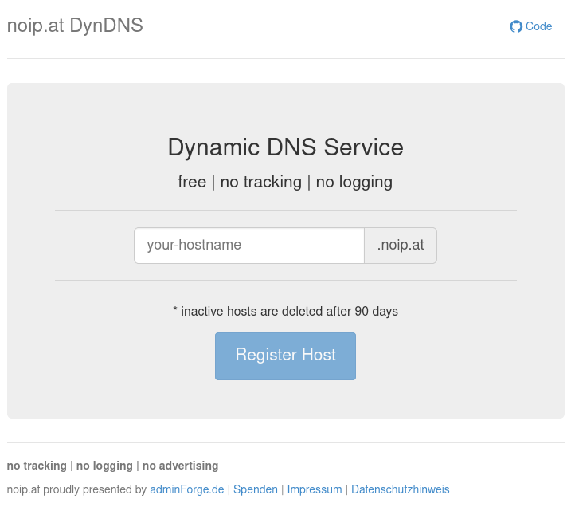

# `ddns` - Dynamic DNS

[](https://github.com/adminforge/ddns)

> Original forked from [pboehm/ddns](https://github.com/pboehm/ddns)

A self-hosted Dynamic DNS solution similar to DynDNS or NO-IP based on the
[PowerDNS Remote Backend](https://doc.powerdns.com/authoritative/backends/remote.html).




## Hosted Dynamic DNS service at noip.at

The hosted `ddns` service available at [noip.at](https://noip.at) is powered by this repository.
You are welcome to try it out and use it in production.

noip.at — proudly operated by [adminForge.de](https://adminforge.de/)

## How can I update my IP if it changes?

`ddns` is built around a small webservice, so that you can update your IP address simply by calling
an URL periodically through `curl`. Hosts that haven't been updated for 90 days will
be automatically removed. This can be configured in your own instance.

An API similar to DynDNS/NO-IP has not been implemented yet.

## Self-Hosting

### Requirements

* A custom domain where the registrar allows setting `NS` records for subdomains. This is important because not all
  DNS providers support this.
* A server with [docker](https://www.docker.com/) and [docker-compose](https://docs.docker.com/compose/) installed
* The following ports should be opened in the firewall:
  * `53/udp`
  * `80/tcp`
  * `443/tcp`

### DNS-Setup

For the domain you want to use with `ddns` (`example.net` in the following sections, please adjust this to your domain)
you have to create the following two DNS records:

* `ddns.example.net` as a `CNAME` or `A`/`AAAA` record pointing to the server `ddns` will be running on. This record
  will be used for accessing the `ddns` frontend in your browser or via `curl`. It is also the target for the
  corresponding `NS` record.
* `d.example.net` as an `NS` record pointing to the previously created `ddns.example.net` record. This will delegate
  all subdomains under `d.example.net` to the PowerDNS server running on `ddns.example.net`.

### `ddns`-Setup

The setup is now automated using [docker-compose](https://docs.docker.com/compose/) and only some customization has
to be made in a `docker-compose.override.yml` file
(a [sample](./docker-compose.override.yml.sample) is available here).

#### Configuring the Setup

The setup included in this repository contains all the components described above and uses
[caddy](https://caddyserver.com/) as a web server, because it provides automatic HTTPS using Lets Encrypt.

```
git clone https://github.com/adminforge/ddns.git
cd ddns
cp docker-compose.override.yml.sample docker-compose.override.yml
```

Please adjust the settings in `docker-compose.override.yml` marked with the `#<<< ....` comments as follows:

* adjust the domain part in lines marked with `# <<< ADJUST DOMAIN` according to your DNS-Setup
* insert your email address in lines marked with `# <<< INSERT EMAIL` which is required for getting certificates
  from Lets Encrypt

Finally execute the following `docker-compose` command, which creates 4 containers in detached mode which are also
started automatically after reboot. For updating an existing installation use the same command because it automatically
rebuilds the containers.

```
docker compose up -d --build
```
#### Available Environment Variables 
... for further customization

| Variable | Default       | Required | Description                                                                                                                                                                       |
| --- |---------------| --- |-----------------------------------------------------------------------------------------------------------------------------------------------------------------------------------|
| DDNS_DOMAIN | d.example.net | yes | DDNS Domain and Zone-Root-Domain                                                                                                                                                  |
| DDNS_SOA_DOMAIN | ddns.example.net              | yes | NS Server and Domain for Frontend                                                                                                                                                 |
| DDNS_EXPIRATION_DAYS | 90            | no | Days how long the dynamic DNS Record is valid                                                                                                                                     |
| PDNS_CARBON_SERVER | empty         | no | Endpoint for collecting PDNS Metrics                                                                                                                                              |
| PDNS_CARBON_OURNAME | empty         | no | Name of this Server for Metric collection                                                                                                                                         |
| PDNS_ZONE_CACHE | true          | no | Zone-Cache Feature in PDNS refuses any requests whihc do not belong to configured Zone. Recommended to leave this on to increase security and the integrity of the DNS responses. |
| DDNS_TTL | 300           | no | TTL of the DNS Records                                                                                                                                                            |

